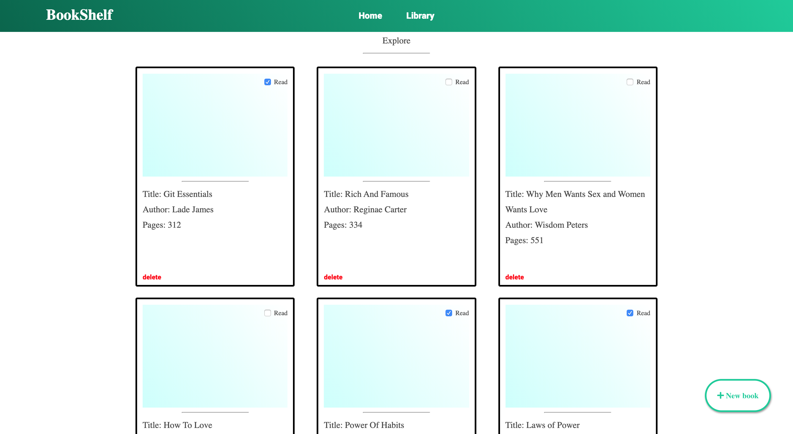

# Library
A library app for curating read and unread books.

## Technologies
HTML

CSS

JavaScript

## Requirements

Browser

Npm (optional to use http-server)

## Installation
> Open your git bash and **cd** to the location you'd like to put your files the run the command below.

`git clone https://github.com/JamesOkunlade/library`

#### To use without server

**cd** to into the project folder and open the `index.html` file with your browser

#### To user with server

**cd** into the project folder, do `npm i` and start the server by doing `npm start` then open up `localhost:8080` on your browser

## Future improvement

- Change the frontend to React.js
- Implement reader, so the book can be read from the app
- Implement PDF download of the books

## Author
[James Okunlade](https://github.com/JamesOkunlade)

[Adnan Afsari](https://github.com/AdnanAfsari)
